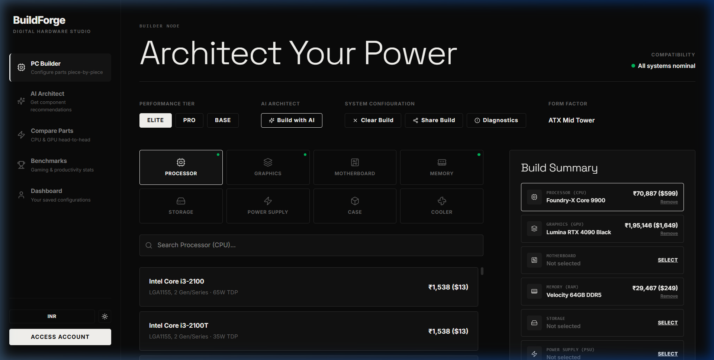

# BuildForge AI

BuildForge AI is a state-of-the-art interactive custom PC builder and hardware diagnostic compiler. It combines dynamic compatibility checking with a generative AI-powered consultant to guide builders in configuring optimal hardware specifications tailored to their workloads.

The project features a client-side React SPA and a secure Express backend server to handle Gemini API integrations privately and securely.

---

## Preview


*Interactive Configuration Dashboard:*


---

## Key Features

* **Interactive PC Builder**: Select and customize computer parts with instant system diagnostics.
* **Compatibility Conflict Engine**: Automatically checks for:
  * **Processor & Motherboard Sockets** (e.g., matching Intel LGA1851/LGA1700 or AMD AM5 sockets).
  * **Memory Types** (e.g., ensuring DDR5 RAM is paired with a DDR5-compatible motherboard).
  * **Power Supply Adequacy** (estimates aggregate draw and compares it against PSU capacity).
* **AI Build Architect**: Compiles complete component specifications (CPU, GPU, RAM, Storage, Case, PSU, Cooler) tailored to a target budget, resolution (1080p, 1440p, 4K), and specific workload vectors (Gaming, Streaming, 3D Rendering, Editing, Programming).
* **Generative Chatbot Architect**: Conversational assistant that answers hardware questions and dynamically builds custom configs that can be loaded straight into your interactive builder canvas.
* **Secure Express Proxy**: Ensures the Google Gemini API key is kept private on the server, enforcing rate-limiting (up to 10 requests/min for Gemini queries) and CORS whitelisting.

---

## Tech Stack

* **Frontend**: React, Vite, TypeScript, TailwindCSS / Custom CSS, Lucide Icons, Zustand (State Management), Recharts
* **Backend**: Node.js, Express, Cors, Express-Rate-Limit, Dotenv

---

## Getting Started

### 1. Installation

Clone or download the project files, then install dependencies for both the frontend (root directory) and backend:

```bash
# Install root frontend packages and concurrently
npm install

# Install secure backend packages
npm --prefix backend install
```

### 2. Environment Configuration

Set up local environment files to connect the frontend and backend:

* Create a `.env` file in the **root** folder:
  ```env
  VITE_BACKEND_URL=http://localhost:3001
  ```
* Create a `.env` file in the **`backend`** folder:
  ```env
  PORT=3001
  FRONTEND_URL=http://localhost:5173
  GEMINI_API_KEY=YOUR_GEMINI_API_KEY_HERE
  ```

### 3. Running Locally

To start both the React frontend and the Express backend server concurrently:

```bash
npm run dev
```

The frontend will run at [http://localhost:5173](http://localhost:5173) and the backend will run at [http://localhost:3001](http://localhost:3001).

---

## Production Deployment

### Backend Server
Deploy the `backend` directory to cloud hosting providers like Render, Railway, or Heroku. Set the environment variables in your hosting dashboard:
- `PORT` (assigned automatically by host or set explicitly)
- `FRONTEND_URL` (URL of your deployed React frontend)
- `GEMINI_API_KEY` (your private API key)

### Frontend client
Build the static frontend bundle (`npm run build`) and host the `/dist` directory on providers like Vercel, Netlify, or Cloudflare Pages.
- Configure `VITE_BACKEND_URL` in the frontend settings to point to your deployed backend URL.

---

## Special Thanks

A very special thanks to **Vritti Thakkar** for helping and supporting me throughout the entire development of this project! Your help was invaluable in bringing BuildForge AI to life.